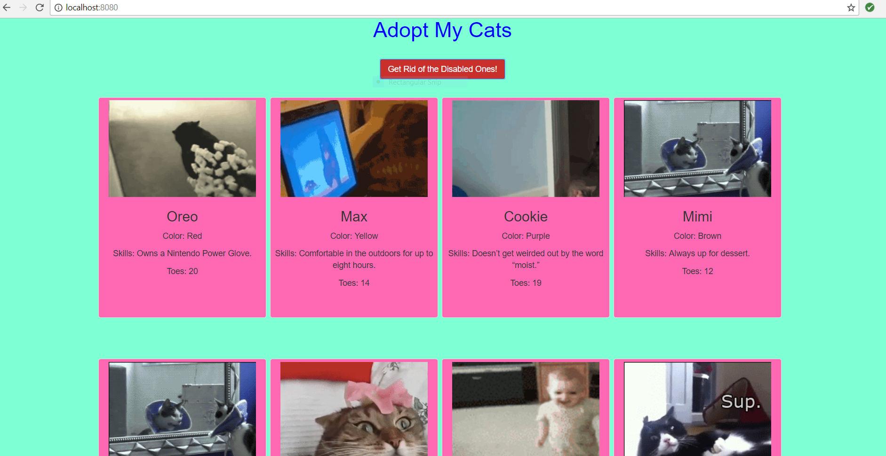

# Adopt My Cats

### Project Summary
This project was my first experience with using jQuery. This project also incorporated concepts we have learned recently, including Browserify and Linting. We were also required to utilize Bootstrap.  

### Instructions
I'm the owner of a cat adoption website. I need a website that allows me to load in the number of cats I currently have available, display them on my screen, then be able to filter them based on whether or not they are considered disabled (have 10 toes or less).

1. On page load, I should see an input box and a button.
    - The input box should prompt me to enter the number of cats I currently have on my site.
    - I should be able to either click the enter key in the input field or the button on the page to submit my number of cats I have.
1. I should be able to make a call to: `https://random-dogs-api.herokuapp.com/cats/NUMBEROFCATZZZZZ` (obviously replacing NUMBEROFCATZZZZZ with the actual number I entered in step 1).
1. Once all the cats come back:
   - They should be displayed on my page in card-like style (use Bootstrap columns to aid in this). 
   - Your card should be a `div`, it should have a nested `div` to display the cat image, it should have another nested `div` to contain all the descriptive elements (each in their own `p` tag).
        ```
        <div class="cat-card">
          <div class="image-container">
            
          </div>
          <div class="description-container">
            <h3> CAT NAME </h3>
            <p> Color: COLORRRR </p>
            <p> Skills: SKILLLLLZ </p>
            <p class="disabled-cat"> Toes: TOESSSS </p>
          </div>
        </div>
       ```
    - If the cat has 10 toes or less, their `p` tag that contains their number of toes should have a class of `disabled-kitty`.
    - The input and button originally shown on the page should be hidden. 
    - A new button should now appear at the top of the page: 'Get Rid Of The Disabled Ones'
4. Once I click on the 'Get Rid Of The Disabled Ones' button, any card on my page that has a `p` tag with the class `disabled-kitty` should be hidden.


### Tools You Should Be Using:
- Browserify
- Grunt
- jQuery (DOM methods, AJAX)
- Linting
- Bootstrap

### Screen Shots of My Project in Use:
###### This is the view of the page on initial load. The input field only accepts a number. When the user types in a number, he/she can click on the "Get Cats!" button or press the Enter key, and that number of cats is printed to the page.


###### When the Enter key is pressed or the Get Cats! button is clicked, the input field and button are hidden and replaced with another button.


###### The "Get Rid of the Disabled Ones!" button removes all the cards of cats with 10 toes or less.


